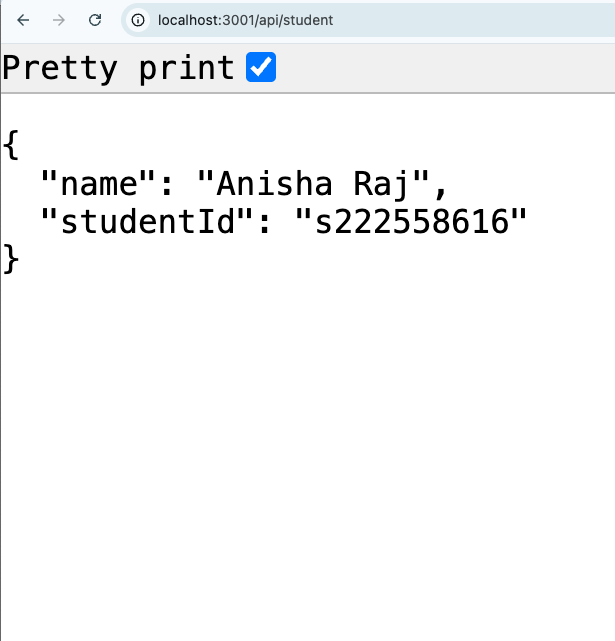

# Running the Dockerized FoodLens Application

Follow these steps to build, run, and verify the FoodLens application using Docker containers.

---

## 1. Clone the Repository

Clone the repository containing the application and Docker files:


```bash 

git clone https://github.com/aniraj2020/SIT725.git

```

---

## 2. Navigate to the Docker Setup Folder

Change directory to the folder with the Docker configuration (week8):

```bash

cd SIT725/week8

```

---

## 3. Build the Docker Image

Build the Docker image using Docker Compose:

```bash

docker-compose build

```

This will install all dependencies and prepare the app container.

---

## 4. Run the Docker Containers

Start the application and MongoDB containers in detached mode:

```bash

docker-compose up -d

```


This runs the app and database in the background.

---

## 5. Access the Application

Open your browser and go to:

```bash

http://localhost:3001

```

You should see the FoodLens web app running inside the Docker container.

---

## 6. Verify the Submission Identity Endpoint

To confirm your submission and verify the app is running your code, visit:

```bash

http://localhost:3001/api/student

```

You should see a JSON response similar to:



---

## Additional Notes

- The `.env` file inside the `week8` folder configures the MongoDB URI for Docker networking:

```bash

MONGO_URI=mongodb://mongo:27017/foodlens

```

- MongoDB data is persisted using a Docker volume named `mongo-data`.

- **To seed the database manually (optional):**

```bash

docker-compose exec app node seed/seedData.js

```

- **To stop the containers:**

```bash

docker-compose down

```

## Reflection

Dockerising the FoodLens application provided valuable insights into containerisation and environment management. One challenge was ensuring the app correctly connected to the MongoDB database running as a separate container. This required configuring the MongoDB URI in the `.env` file to use the Docker service name, allowing seamless networking between containers.

I created and configured a `docker-compose.yml` file to orchestrate the FoodLens application and MongoDB containers, manage environment variables, ports, and volumes, enabling easy deployment and testing with a single command.

Managing environment variables securely using a `.env` file and integrating it with Docker Compose helped me understand best practices in configuration management. The process of writing the Dockerfile and Docker Compose setup deepened my appreciation for how container orchestration simplifies deployment and testing.

Finally, successfully running the full stack inside containers and verifying the unique /api/student endpoint, which clearly identifies my submission. Overall, this task enhanced my practical skills in Docker, environment configuration, and deploying Node.js applications with databases.

